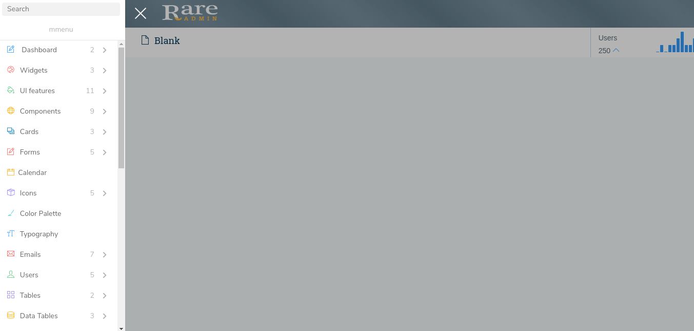
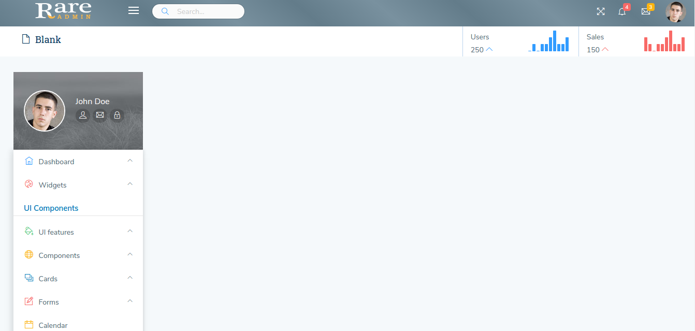

# Commands

Commands for different layouts

To generate files, you need to run following command

gulp nunjucks --**layout style** &lt;space&gt; --**breadcrum style**

ex: `gulp nunjucks --layout default --breadcrumb 0 --color primary`

Following table explains all available layouts and the command to use,

please note that you need to pass 0 to 5... one of the breadcrumb styles along with layout command.

| Layout Name | Command | Layout Image |
| :--- | :--- | :---: |
| default | gulp nunjucks --layout default --breadcrumb \(0 to 5\) --color \* |  |
| compact menu | gulp nunjucks --layout compact-menu --breadcrumb \(0 to 5\) --color \* |  |
| centered logo | gulp nunjucks --layout centered-logo --breadcrumb \(0 to 5\) --color \* |  |
| horizontal menu | gulp nunjucks --layout horizontal-layout --breadcrumb \(0 to 5\) --color \* |  |
| icon horizontal menu | gulp nunjucks --layout icon-horizontal --breadcrumb \(0 to 5\) --color \* |  |
| fixed menu | gulp nunjucks --layout fixed-menu --breadcrumb \(0 to 5\) --color \* |  |
| fixed header | gulp nunjucks --layout fixed-header --breadcrumb\(0 to 5\) --color \* |  |
| full width | gulp nunjucks --layout fullwidth-layout --breadcrumb \(0 to 5\) --color \* |  |
| fixed footer | gulp nunjucks --layout fixed-footer --breadcrumb \(0 to 5\) --color \* |  |
| dark layout | gulp nunjucks --layout dark-layout --breadcrumb \(0 to 5\) --color \* |  |
| header style1 | gulp nunjucks --layout header-style1 --breadcrumb \(0 to 5\) --color \* |  |
| Mmenu | gulp nunjucks --layout mmenu --breadcrumb \(0 to 5\) --color \* |  |
| Light Sidebar | gulp nunjucks --layout light-sidebar --breadcrumb \(0 to 5\) --color \* |  |

Where`--color *` is

`--color default`

`--color primary`

`--color success`

`--color danger`

`--color mint`

`--color purple`

