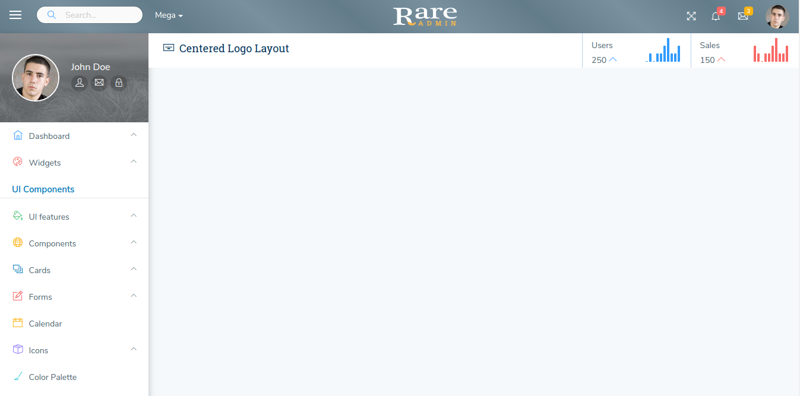

# Centered Logo

The design for the blank page in Centered Logo by run the command `gulp nunjucks --layout centered-logo` through builder is shown below :

And you can change breadcrumb and color for header in this layout by run the command `gulp nunjucks --layout default --beadcrumb * --color *`

Where `--beadcrumb *`is

`--breadcrumb (default,0,1,2,3,4,5)`

Where `--color *`is

`--color (default,primary,success,danger,mint,purple)`



It has the following Structure:

```text
<!DOCTYPE html>
<html lang="en">
<head>
    <title>{{title}} | Rare admin</title>
    <!--Start common styles-->
    
    <!--End common styles-->
    <!--Start page styles-->
    
    <link type="text/css" rel="stylesheet" href="css/pages/layout3.css" />
    <!--End page styles-->
</head>

<body class="centered_logo">
<!--Start centered logo header-->

<!--End centered logo header-->
<!--Start Wrapper-->
<div class="wrapper">
    <!--Start leftmenu-->

    <!--End left menu-->
    <div class="right-aside view-port-height">
        <!--Start breadcrumb-->
        
        <!--End breadcrumb-->
        <!--Start block content-->
        
        <!--End block content-->
    </div>
</div>
<!--End wrapper-->
<!--Start footer-->

<!--End footer-->
<!--Start centered logo common scripts-->

<script type="text/javascript" src="vendors/echarts/js/echarts.min.js"></script>
<script type="text/javascript" src="vendors/jquery_easy_ticker/js/jquery.easy-ticker.js"></script>
<script type="text/javascript" src="src/js/pages/layout3.js"></script>
<!--End centered logo common scripts-->
<!--Start footer scripts-->

<!--End footer scripts-->
</body>
</html>
```

