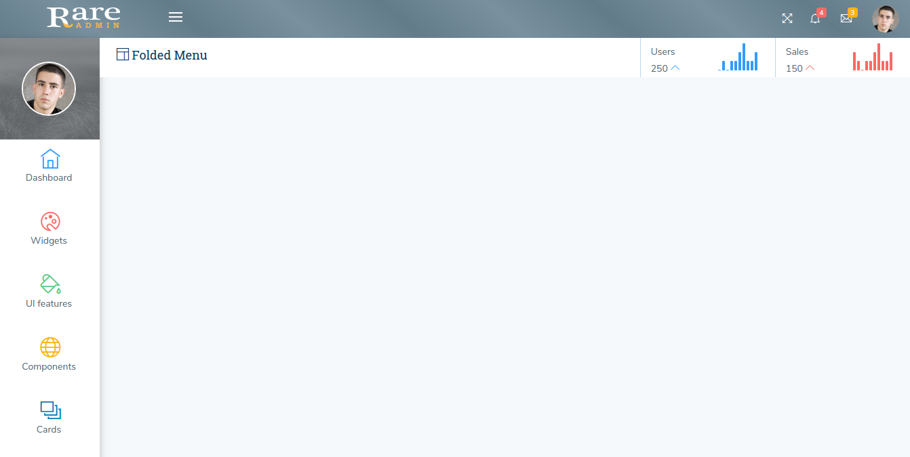

# Compact Menu

The design for the blank page in Compact Menu by run command `gulp nunjucks --layout compact-menu --breadcrumb * --color *` through builder is shown below:

And you can change breadcrumb and color for header in this layout by run the command `gulp nunjucks --layout default --beadcrumb * --color *`

Where `--beadcrumb *`is

`--breadcrumb (default,0,1,2,3,4,5)`

Where `--color *`is

`--color (default,primary,success,danger,mint,purple)`



It has the following Structure:

```text
<!DOCTYPE html>
<html lang="en">
<head>
    <title>{{title}} | Rare admin</title>
    <!--Start common styles-->
    
    <!--End common styles-->
    <!--Start page level styles-->
    <link type="text/css" rel="stylesheet" href="vendors/jScrollPane/css/jquery.jscrollpane.css">
    <link type="text/css" rel="stylesheet" href="css/pages/folded_menu.css">
    
    <!--End page level styles-->
</head>

<body>
<!--Start compact menu header-->

<!--End compact menu header-->
<!--Start Wrapper-->
<div class="wrapper">
    <!--Start compact left menu-->

    <!--End compact left menu-->
    <div class="right-aside view-port-height">
        <!--Start breadcrumb-->
        
        <!--End breadcrumb-->
        <!--Start block content-->
        
        <!--End block content-->
    </div>
</div>
<!--End Wrapper-->
<!--Start footer-->

<!--End footer-->
<!--Start common scripts-->

<script type="text/javascript" src="vendors/jScrollPane/js/jquery.jscrollpane.min.js"></script>
<script type="text/javascript" src="vendors/jScrollPane/js/jquery.mousewheel.js"></script>
<script type="text/javascript" src="vendors/jScrollPane/js/mwheelIntent.js"></script>
<script type="text/javascript" src="js/pages/folded_menu.js"></script>
<!--End common scripts-->
<!--Start page level scripts-->

<!--End page level scripts-->
</body>
</html>
```

