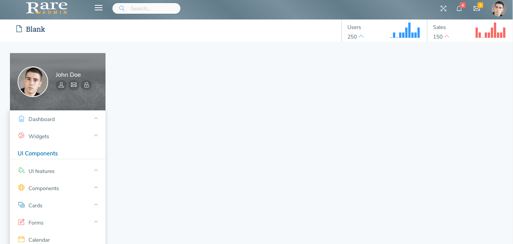

# Light Sidebar

The design for the blank page in Light sidebar Layout by run the command `gulp nunjucks --layout light-sidebar --breadcrumb * --color *` through builder is shown below:

And you can change breadcrumb and color for header in this layout by run the command `gulp nunjucks --layout default --beadcrumb * --color *`

Where `--beadcrumb *`is

`--breadcrumb (default,0,1,2,3,4,5)`

Where `--color *`is

`--color (default,primary,success,danger,mint,purple)`



It has the following Structure:

```text
<!DOCTYPE html>
<html lang="en">
<head>
    <title>{{title}} | Rare admin</title>
    <!--Start common styles-->
    
    <!--End common styles-->
    <!--Start page level styles-->
    
    <link type="text/css" rel="stylesheet" href="css/pages/light_sidebar.css" />
    <!--End page level styles-->
</head>
<body>
<!--Start header-->

<!--End header-->
<!--Start breadcrumb-->

<!--End breadcrumb-->
<!--Start wrapper-->
<div class="wrapper">
    <!--Start leftmenu-->
    
    <!--End leftmenu-->
    <div class="right-aside view-port-height">
        <!--Start block content-->
    
        <!--End block content-->
    </div>
</div>
<!--Start footer-->

<!--End footer-->
<!--Start common scripts-->

<!--End common scripts-->
<!--Start page level scripts-->

<!--End page level scripts-->
</body>
</html>
```

