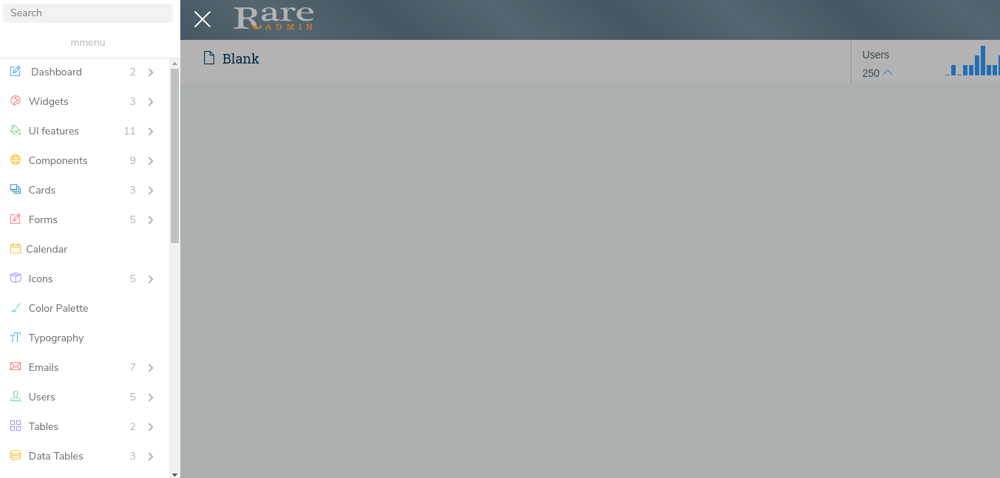

# Mmenu

The design for the blank page in Mmenu Layout by run the command `gulp nunjucks --layout mmenu --breadcrumb * --color *` through builder is shown below:

And you can change breadcrumb and color for header in this layout by run the command `gulp nunjucks --layout default --beadcrumb * --color *`

Where `--beadcrumb *`is

`--breadcrumb (default,0,1,2,3,4,5)`

Where `--color *`is

`--color (default,primary,success,danger,mint,purple)`



It has the following Structure:

```text
<!DOCTYPE html>
<html lang="en">
<head>
    <title>{{title}} | Rare admin</title>
    <!--Start comon styles-->
    
    <!--End common styles-->
    <!--Start page level styles-->
    <link type="text/css" rel="stylesheet" href="css/plugincss/layout.css" />
    <link type="text/css" rel="stylesheet" href="vendors/mmenu/css/jquery.mmenu.all.css" />
    <link type="text/css" rel="stylesheet" href="vendors/mmenu/css/jquery.mmenu.widescreen.css" media="all and (min-width: 1430px)"/>
    <link type="text/css" rel="stylesheet" href="css/pages/mmenu.css" />
    <link type="text/css" rel="stylesheet" href="http://mmenu.frebsite.nl/css/hamburgers.min.css" />
    <noscript>
        <link rel="stylesheet" href="css/pages/mmenu_noscript.css">
    </noscript>
    
    <!--End page level styles-->
</head>
<body class="fixed_header">
<!--Start header-->
<div id="page" class="mm-slideout">
    <a href="#" id="hamburger" class="Fixed">
        <span class="hamburger hamburger--collapse">
            <span class="hamburger-box">
                <span class="hamburger-inner"></span>
            </span>
        </span>
    </a>

<!--End header-->
<div class="wrapper">
    <div class="right-aside view-port-height">
        <!--Start breadcrumb-->
        
        <!--End breadcrumb-->
        <!--Start block content-->
        
        <!--End block content-->
    </div>
</div>
<!--Start left menu-->

<!--End left menu-->
<!--Start footer-->
    
<!--End footer-->
<!--Start common scripts-->
    
    <script type="text/javascript" src="js/pluginjs/layout.js"></script>
    <script type="text/javascript" src="vendors/mmenu/js/jquery.mmenu.all.min.js"></script>
    <script type="text/javascript" src="js/pages/mmenu.js"></script>
<!--End common scripts-->
<!--Start page level scripts-->
    
<!--End page level scripts-->
</body>
</html>
```

