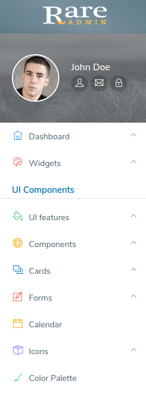

# Left Side Menu

It has the following design:



The Side Bar has the following structure :

```text
<!-- Start Left side menu -->
    <div class="left_aside">

        <!-- sidebar: style can be found in sidebar-->
            <div class="sidebar">

                <!--user profile section-->
                <div class="user_section">
                <!--user profile content-->
            </div>
        <!--user profile section-->


        <!--Start Left menu links-->

            <div id="menu" role="navigation">
                <ul class="navigation">

                </ul>
            </div>

        <!--End Left menu links-->

        </div>
        <!-- sidebar: style can be found in sidebar-->
</div>
<!-- End of Left side menu -->
```

