# Buttons

There are 13 variants of buttons based on the colors used in this template, we can change the color of the button just by replacing `btn-primary`with `btn-secondary , btn-info, btn-success, btn-warning, btn-danger,btn-purple,btn-mint`.

Since this template is based on Bootstrap4`btn-default`is depricated and `btn-secondary`is brought into act.

These buttons are implemented in the page [buttons.html](http://new-admin.lorvent.in/buttons.html) of this template.

**1\) Basic Buttons:**

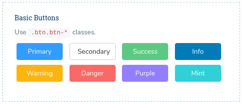

It has the following Structure:

```text
<button type="button" class="btn btn-primary btn_width m-t-10 m-r-10">Primary</button>
```

**2\) Squared Buttons:**

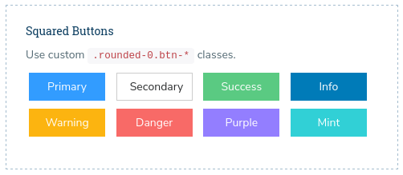

It has the following Structure

```text
<button type="button" class="btn btn-primary btn_width m-t-10 m-r-10 rounded-0">Primary</button>
```

**3\) Rounded Buttons:**

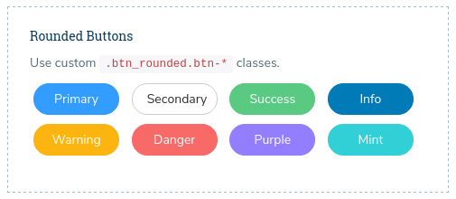

It has the following Structure

```text
<button type="button" class="btn btn-primary btn_width m-t-10 m-r-10 btn_rounded">Primary</button>
```

**4\) Basic outline Buttons:**

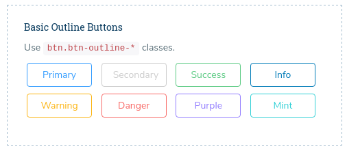

It has the following Structure

```text
<button type="button" class="btn btn-outline-primary btn_width m-t-10 m-r-10">Primary</button>
```

**5\) Squared outline Buttons:**

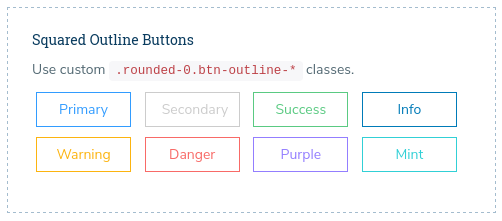

It has the following Structure

```text
<button type="button" class="btn btn-outline-primary btn_width m-t-10 m-r-10 rounded-0">Primary</button>
```

**6\) Rounded Outline Buttons:**

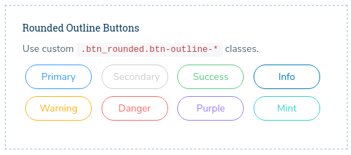

It has the following Structure

```text
<button type="button" class="btn btn-outline-primary btn_width btn_rounded m-t-10 m-r-10">Primary</button>
```

**7\) Dropdown Buttons :**


It has the following Structure

```text
<div class="btn-group m-t-10 m-r-10">
     <button type="button" class="btn btn-primary dropdown-toggle btn_width" id="about-us1" data-toggle="dropdown" aria-haspopup="true" aria-expanded="false">......</button>
             <div class="dropdown-menu" aria-labelledby="about-us1">
                  <a class="dropdown-item" href="#">.....</a>
                  <a class="dropdown-item" href="#">.....</a>
                  <a class="dropdown-item" href="#">.....</a>
                  <div class="dropdown-divider"></div>
                  <a class="dropdown-item" href="#">.....</a>
             </div>
</div>
```

**8\) Dropup Buttons:**

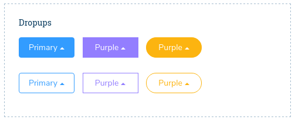

It has the following Structure

```text
<div class="btn-group dropup m-t-10 m-r-10">
    <button type="button" class="btn btn-primary dropdown-toggle btn_width" id="about-us10" data-toggle="dropdown" aria-haspopup="true" aria-expanded="false">.........</button>
            <div class="dropdown-menu" aria-labelledby="about-us10">
                 <a class="dropdown-item" href="#">.....</a>
                 <a class="dropdown-item" href="#">.....</a>
                 <a class="dropdown-item" href="#">.....</a>
            <div class="dropdown-divider"></div>
                 <a class="dropdown-item" href="#">.....</a>
            </div>
</div>
```

**9\) Buttons with Icons:**

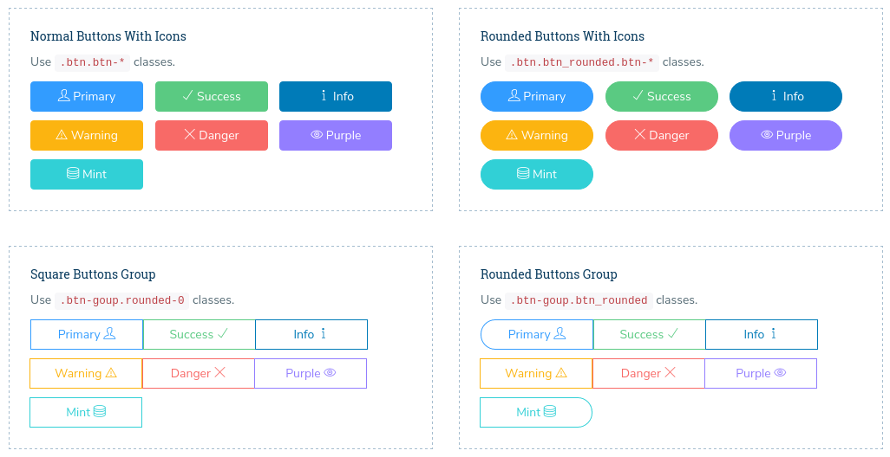

There are basically four types of buttons with icons implemented .

you can learn more about the Buttons with Icons in the page [buttons.html](http://new-admin.lorvent.in/buttons.html) of this template.

It has the following Structure

```text
<button type="button" class="btn btn-primary btn_lg_width m-t-10 m-r-10">
        <i class="ti-user"></i> ......
</button>
```

**10\) Split Buttons:**

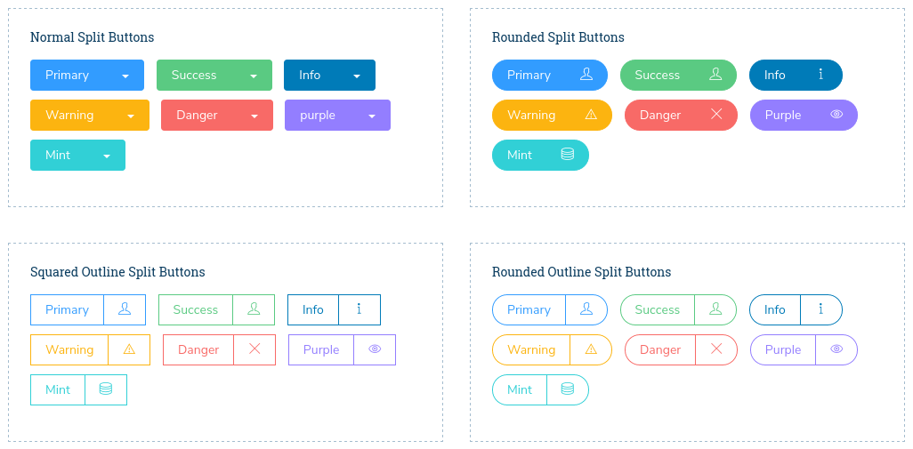

It has the following Structure

```text
<div class="btn-group m-t-10 m-r-10">
        <button type="button" class="btn btn-outline-primary rounded-0">Primary</button>
                <button type="button" class="btn btn-outline-primary rounded-0">
                                <i class="ti-user"></i>
                </button>
</div>
```

**11\) Vertical Buttons:**

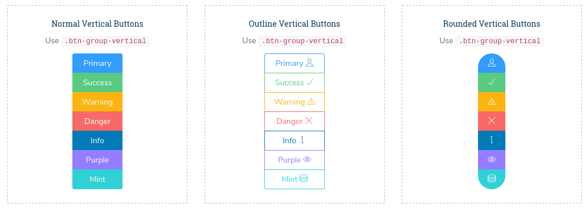

It has the following Structure

```text
<div class="btn-group-vertical m-t-10">
           <button type="button" class="btn btn-primary">Primary</button>
           <button type="button" class="btn btn-success">Success</button>
           <button type="button" class="btn btn-warning">Warning</button>
           <button type="button" class="btn btn-danger">Danger</button>
           <button type="button" class="btn btn-info">Info</button>
           <button type="button" class="btn btn-purple">Purple</button>
           <button type="button" class="btn btn-mint">Mint</button>
</div>
```

**12\) Icons Buttons:**

There are two variants of Icon buttons implemented in this template.

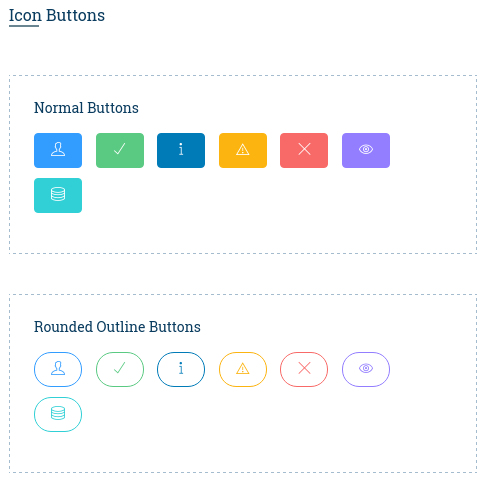

It has the following Structure:

```text
 <button type="button" class="btn btn-primary m-t-10 m-r-10
         <i class="ti-user"></i>
 </button>
```

**13\) Social Buttons:**

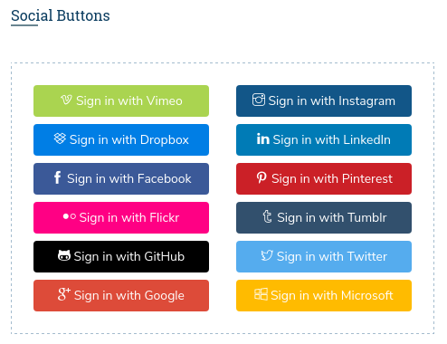

It has the following Structure

```text
<a class="btn btn-block btn-social btn-vimeo">
         <i class="ti-vimeo"></i>
                Sign in with Vimeo
</a>
```

