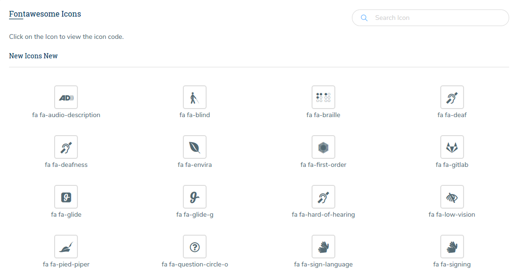
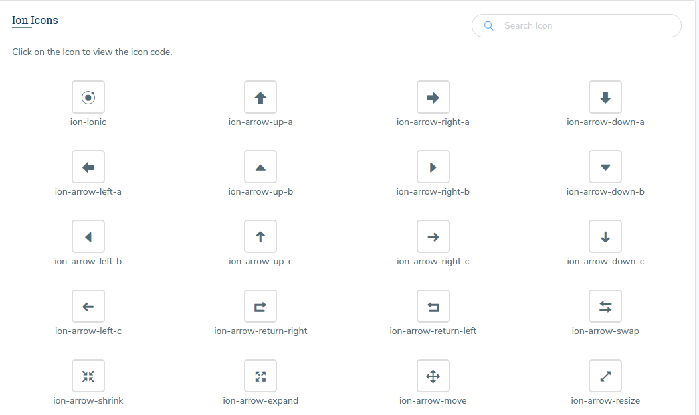
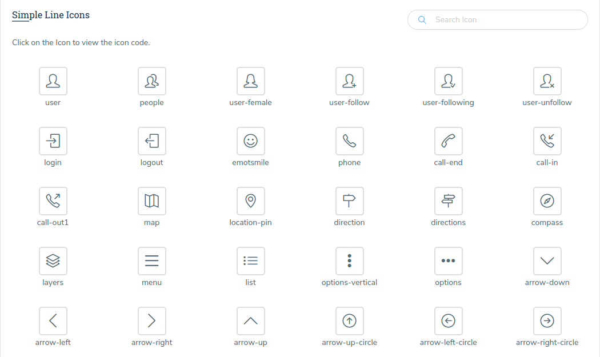
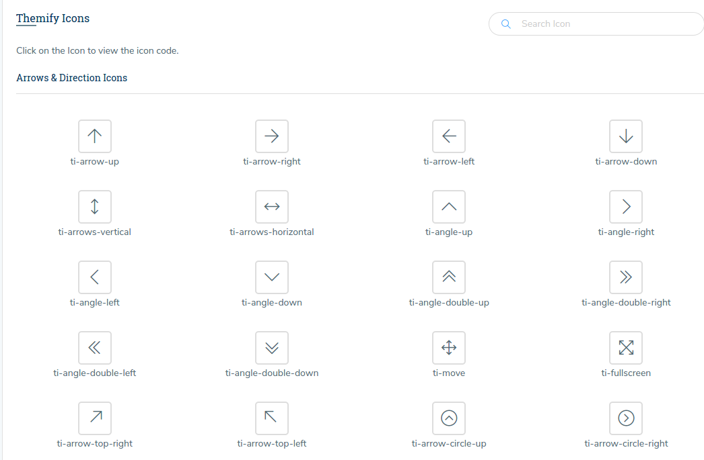
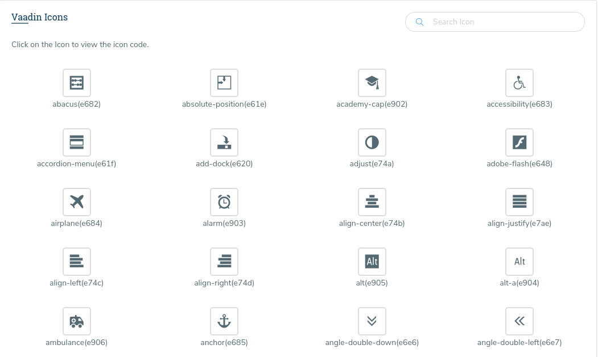

# Fonts

There are five different types of icons used in this theme. They are presented in different pages, in each page we have a search box on the right side to search for the particular icon. with the click on an icon you will get a pop up that has a code, you can copy the code to use that icon.

**1\) Font Awesome Icons :**

These icons are present in the page [fontawesome\_icons.html](http://new-admin.lorvent.in/fontawesome_icons.html) of the template.It has the following Structure:

```text
<a href="#">
  <i class="fa fa-phone"></i>
</a>
```

**Icons Size** - determines the size of icons, can take such values: fa-lg, fa-2x, fa-3x, fa-4x and fa-5x

```text
<a href="#">
  <i class="fa fa-phone fa-lg"></i>
</a>
```

**Stacked icons** - It stacks the multiple icons. we can also control the size of the icons using the parameters : fa-stack-1x fa-stack-2x.

```text
<span class="fa-stack fa-lg">
 <i class="fa fa-circle fa-stack-2x text-info"></i>
   <i class="fa fa-home fa-stack-2x fa-inverse"></i>
</span>
```

**2\) Ion Icons**

These icons are present in the page [ion\_icons.html](http://new-admin.lorvent.in/ion_icons.html) of the template.

It has the following Structure:

```text
<a href="#">
  <i class="ion-ionic"></i>
</a>
```

We can import our desired icon just by replacing `ion ionic`in the above code with the icon we want.

**3\) Simple Line Icons**

These icons are present in the page [simple\_line\_icons.html](http://new-admin.lorvent.in/simple_line_icons.html) of the template.It has the following Structure:

```text
<a href="#">
  <i class="icon-user"></i>
</a>
```

We can import our desired icon just by replacing `icon-user`in the above code with the icon we want.

**4\) Themify Icons**

These icons are present in the page [themify\_icons.html](http://new-admin.lorvent.in/themify_icons.html) of the template.It has the following Structure:

```text
<a href="#">
  <i class="ti-arrow-up"></i>
</a>
```

We can import our desired icon just by replacing `ti-arrow-up` in the above code with the icon we want.

**5\) Vaadin Icons**

These icons are present in the page [vaadin\_icons.html](http://new-admin.lorvent.in/vaadin_icons.html) of the template.It has the following Structure:

```text
<div class="col-sm-6 col-lg-4 col-xl-3 col-12 m-t-30 fa_icon text-center" id="icon-e682">
           <span class="font_text">
                 <i class="icon"></i>
           </span>abacus(e682)
</div>
```

We can import our desired icon just by changing the `id` in the above code.

