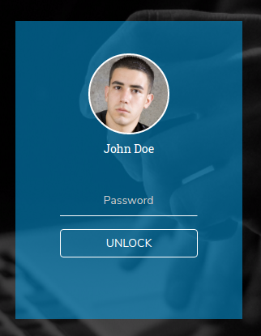

# Lock Screens

This is the unique feature in this template which generally is designed for the Authentication purposes.This element can be found in [lockscreen.html](http://new-admin.lorvent.in/lockscreen.html) page of this template.

It has the following design :



It has the following Structure:

```text
<div class="row">
    <div class="col-lg-4">
       <div class="login-container">
             ...
             ...
       </div>
    </div>
</div>
```

