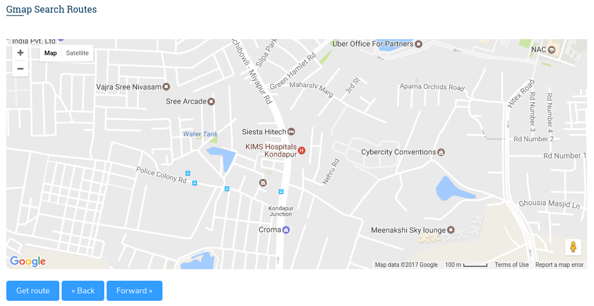
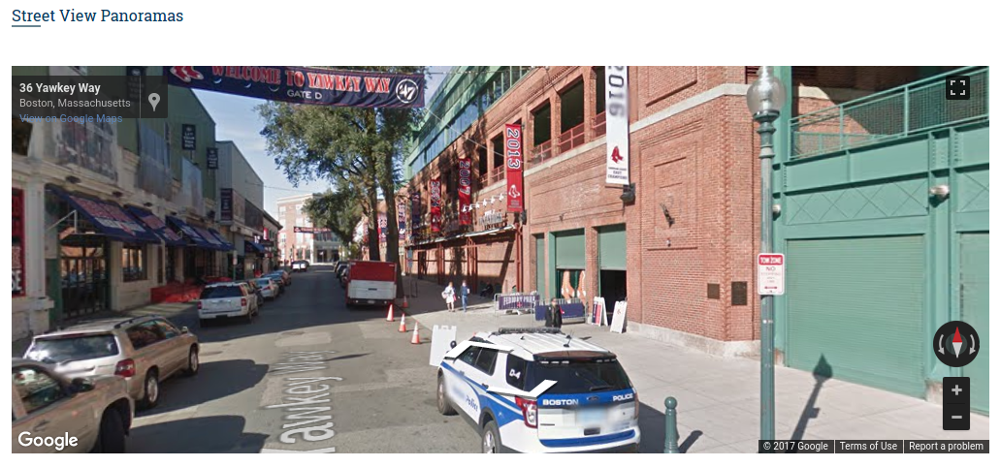
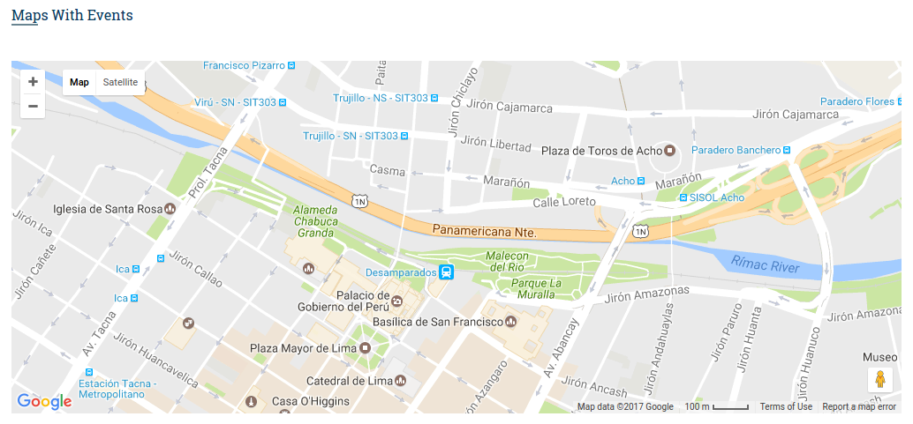
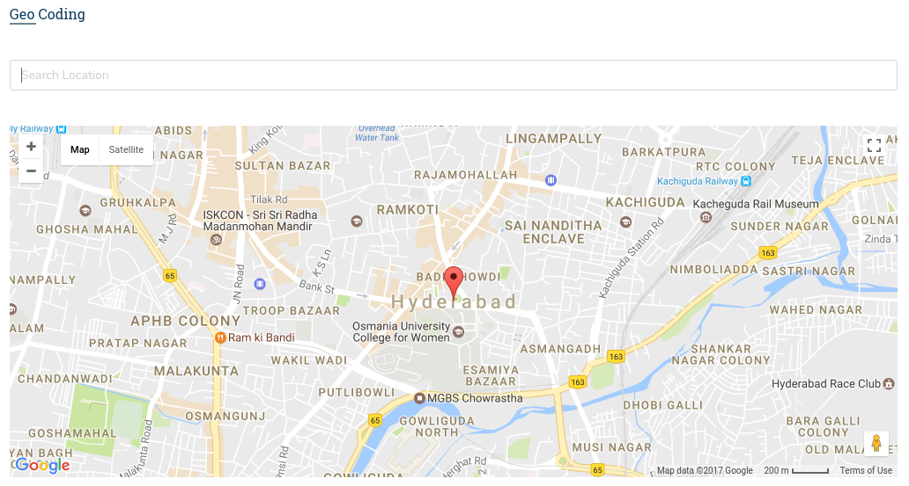
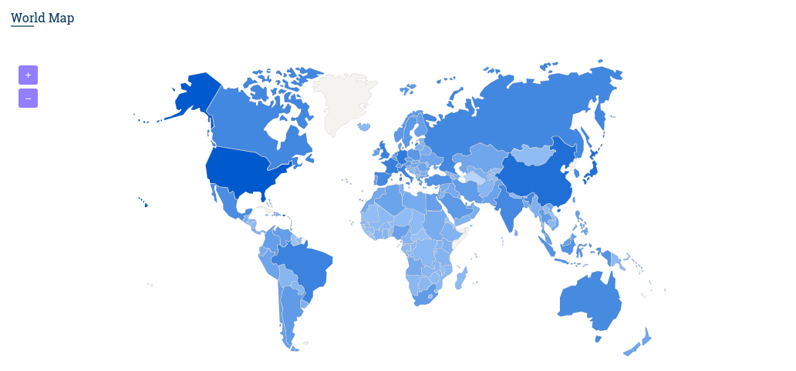

# Maps

There are two divergent maps included in this template. we have further classified the maps into different categories.

**1\) Google Maps :**

we have included the four different types of gmaps in this template, let us have a look at each one briefly one after the another.

**i\) Gmap Routes :**

There are three different Gmap Routes being included in this template, you can find more about this map in the page [gmap\_routes.html](http://new-admin.lorvent.in/gmap_routes.html) of this template.

It has the following design



It has the following structure:

```text
<div id="gmap_routes3 class="gmap">
</div>
```

**ii\) Gmap Utils :**

There are six different Gmap Utils being included in this template, you can find more about this map in the page [gmap\_utils.html](http://new-admin.lorvent.in/gmap_utils.html) of this template.

It has the following design :

It has the following structure:

```text
<div id="gmap6" class="map">
</div>
```

**iii\) Basic Maps**

There are five different types of Basic maps being included in this template, you can find more about this map in the page [gmaps\_basic.html](http://new-admin.lorvent.in/gmaps_basic.html) of this template.

It has the followig design :

It has the following structure :

```text
<div id="map_events" class="gmap m-t-40">
</div>
```

**iv\) Gmap Services**

There are five different types of Gmap services being included in this template, you can find more about this map in the page [gmaps\_services.html](http://new-admin.lorvent.in/gmaps_services.html) of this template.

It has the followig design :

It has the following structure :

```text
<div id="geo_code" class="gmap m-t-40">
</div>
```

All the Gmaps basically will have the following parameters and they are

i**\) zoom** - This attribute sets the scale of the map \(by default - '8'\).This option is available is in the js file.

```text
zoom : 8
```

ii**\)** **center \[lat , lng\]** - these attributes set the coordinates of the center of the map and the point of the map \(by default - '17.400408 and '78.507905'\). This option is available in Js file.

```text
center : [17.400408, 78.507905]
```

iii**\) hue** - sets the hue of the feature to match the hue of the color supplied. Note that the saturation and lightness of the feature is conserved, which means that the feature will not match the color supplied exactly. Valid values: An RGB hex string, i.e. '\#ff0000'. This option is available in the js file.

```text
hue : '#0075c2'
```

iv**\) Address** - This feature allows us to mention the current location. This option is available in the js file.

```text
address : "nallakunta,hyderabad"
```

v**\) Marker** - This feature allows the user to explicitly indicate the location. This option is available in the js file.

```text
icon : "images/location-mark.png"
```

**2\) Vector Maps :**

We can find different styles of this kind in the page [vectormaps.html](http://new-admin.lorvent.in/vectormaps.html).



It has the following Structure

```text
<div id="world_map" class="vector_maps m-t-40">
    ...
</div>
```

