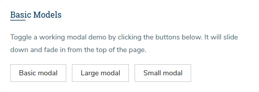
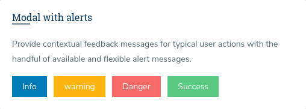
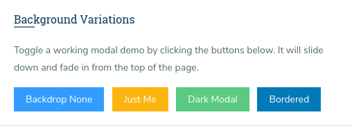
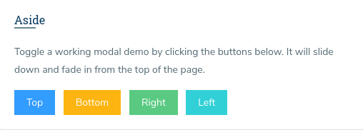
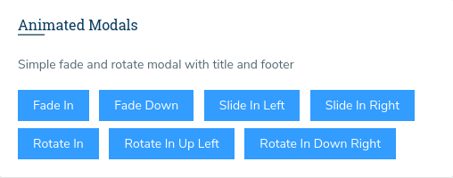
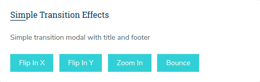
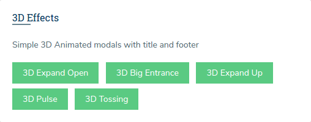
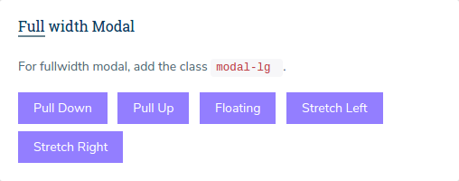
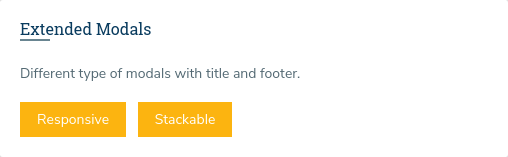

# Modals

This feature is found in the [modals.html](http://new-admin.lorvent.in/modals.html) page of this Template.

There are Nine different kinds of modals included in the above mentioned page. Upon clicking on each button a pop up with different fashion appears on the screen.

**1\) Basic Modals**



It has the following Structure:

This is the syntax for the button and with the click on a button, the control goes to the code shown below to display the modal

```text
<button type="button" class="btn btn-secondary mr-2 mt-2" data-toggle="modal" data-target="#basic_modal1">Basic modal
 </button>
```

Modal Syntax:

```text
<div class="modal fade" id="basic_modal1" tab-index="-1" role="dialog" aria-hidden="true">
     <div class="modal-dialog" role="document">
          <div class="modal-content">
           ....
           ....
          </div>
      </div>
</div>
```

We can learn more about modals at [Modals](http://getbootstrap.com/).

**2\) Modal with alerts:**



It has the following Structure:

This is the syntax for the button and with the click on a button, the control goes to the code shown below to display the modal.

```text
<button type="button" class="btn btn-info mr-2 mt-2" data-toggle="modal" data-target="#alert_modal1">Info</button>
```

Modal Syntax:

```text
<div class="modal fade" id="alert_modal1" tab-index=-1 role="dialog" aria-hidden="true" >
     <div class="modal-dialog" role="document">
          <div class="modal-content">
           ....
           ....
          </div>
      </div>
</div>
```

We can learn more about modals at [Modals](http://getbootstrap.com/).

**3\) Background Variations:**



It has the following Structure:

This is the syntax for the button and with the click on a button, the control goes to the code shown below to display the modal.

```text
<button type="button" class="btn btn-primary mr-2 mt-2 dropback1" data-toggle="modal" data-target="#dropback1">Backdrop None</button>
```

Modal Syntax:

```text
<div class="modal fade" id="dropback1" tabindex="-1" role="dialog" aria-labelledby="dropbackmodal1" aria-hidden="true">
     <div class="modal-dialog" role="document">
          <div class="modal-content">
           ....
           ....
          </div>
      </div>
</div>
```

We can learn more about modals at [Modals](http://getbootstrap.com/).

**4\) Aside:**



It has the following Structure:

This is the syntax for the button and with the click on a button, the control goes to the code shown below to display the modal.

```text
<button type="button" class="btn btn-primary mt-2 mr-2" data-toggle="modal" data-target="#aside1">Top</button>
```

Modal Syntax:

```text
<div class="modal fade" id="aside1" tabindex="-1" role="dialog" aria-labelledby="asidemodal1" aria-hidden="true">
     <div class="modal-dialog" role="document">
          <div class="modal-content">
           ....
           ....
          </div>
      </div>
</div>
```

We can learn more about modals at [Modals](http://getbootstrap.com/).

**5\) Animated Modals:**



It has the following Structure:

This is the syntax for the button and with the click on a button, the control goes to the code shown below to display the modal.

```text
<button type="button" class="btn btn-primary mr-2 mt-2 fadein" data-toggle="modal" data-target="#fadein">Fade In</button>
```

Modal Syntax:

```text
<div class="modal" id="fadein" tabindex="-1" role="dialog" aria-hidden="true">
     <div class="modal-dialog" role="document">
          <div class="modal-content">
           ....
           ....
          </div>
      </div>
</div>
```

We can learn more about modals at [Modals](http://getbootstrap.com/).

**6\) Simple Transition Effects:**



It has the following Structure:

This is the syntax for the button and with the click on a button, the control goes to the code shown below to display the modal.

```text
<button type="button" class="btn btn-mint mr-2 mt-1 flipinx" data-toggle="modal" data-target="#flipinx">Flip In X</button>
```

Modal Syntax:

```text
<div class="modal" id="flipinx" tabindex="-1" role="dialog" aria-hidden="true">
     <div class="modal-dialog" role="document">
          <div class="modal-content">
           ....
           ....
          </div>
      </div>
</div>
```

We can learn more about modals at [Modals](http://getbootstrap.com/).

**7\) 3D Effects:**



It has the following Structure:

This is the syntax for the button and with the click on a button, the control goes to the code shown below to display the modal.

```text
<button class="btn btn-raised btn-success mr-2 mt-2" data-toggle="modal" data-target="#modal_3d1">3D Expand Open </button>
```

Modal Syntax:

```text
<div class="modal expandOpen" id="modal_3d1" tabindex="-1" role="dialog"  aria-hidden="true">
     <div class="modal-dialog modal-lg">
          <div class="modal-content">
           ....
           ....
          </div>
      </div>
</div>
```

We can learn more about modals at [Modals](http://getbootstrap.com/).

**8\) Fullwidth Modals:**



It has the following Structure:

This is the syntax for the button and with the click on a button, the control goes to the code shown below to display the modal.

```text
<button class="btn btn-raised btn-purple mr-2 mt-2 pulldown" data-toggle="modal" data-target="#pulldown">Pull Down </button>
```

Modal Syntax:

```text
<div class="modal expandOpen" id="modal_3d1" tabindex="-1" role="dialog"  aria-hidden="true">
     <div class="modal-dialog modal-lg" role="document">
          <div class="modal-content">
           ....
           ....
          </div>
      </div>
</div>
```

We can learn more about modals at [Modals](http://getbootstrap.com/).

**9\) 3D Effects:**



It has the following Structure:

This is the syntax for the button and with the click on a button, the control goes to the code shown below to display the modal.

```text
<button class="btn btn-raised btn-warning mr-2 mt-2" data-toggle="modal" data-target="#responsive">Responsive</button>
```

Modal Syntax:

```text
<div class="modal pullDown " id="responsive" tabindex="-1" role="dialog" aria-hidden="true">
     <div class="modal-dialog" role="document">
          <div class="modal-content">
           ....
           ....
          </div>
      </div>
</div>
```

We can learn more about modals at [Modals](http://getbootstrap.com/).

