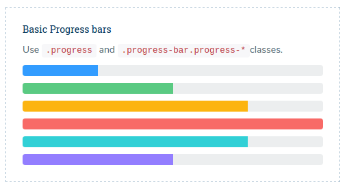

# Progress Bars

we have basically classified progress bars into two categories and they are Progress bars and Advanced progress bars, which in turn have the other sections . To know more about it visit the page [general\_components.html](http://new-admin.lorvent.in/general_components.html) of our template.

It has the following design:



**Horizontal Progress Bar**

```text
<div class="progress">
    <div class="progress-bar" style="width: 70%;">Content</div>
</div>
```

_**parameters:**_

**1\) Background color** - sets the color of the background. Can take values - progress-info, progress-success, progress-warning, progress-danger.

```text
<div class="progress">
    <div class="progress-bar progress-bar-success" style="width: 70%;">Content</div>
</div>
```

**2\) striped** - uses a gradient to create a striped effect.

```text
<div class="progress progress-striped">
   <div class="progress-bar" style="width: 70%;">Content</div>
</div>
```

**3\) animated striped** - add`.active`to`.progress-striped`to animate the stripes left to right.

```text
<div class="progress progress-striped active">
    <div class="progress-bar" style="width: 70%;">Content</div>
</div>
```

4\) **animated** - sets the animation till the percentage given to attribute.

```text
<div class="progress" data-appear-progress-animation="70%">
   <div class="progress-bar">Content</div>
</div>
```

