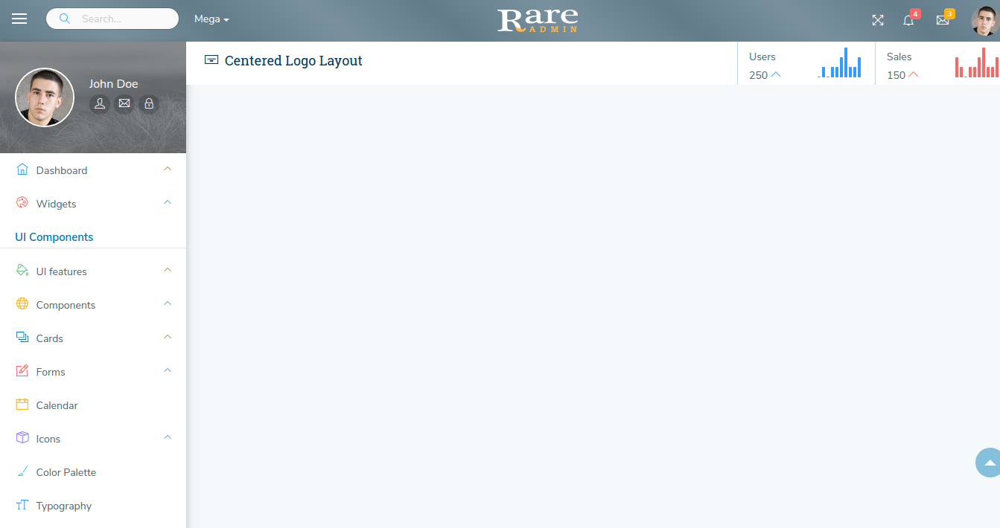

# Centered Logo

The design for the Centered Logo Layout is shown below:



It has the following Structure:

```text
<html>
   <head>
        <title> </title>
   </head>
<body>
     <header class="header">
        <nav class="navbar navbar-static-top">
                <a href="index.html" class="logo navbar-brand text-white text-center">
                        <!--It contains logo-->
                </a>
        <div class="navbar-btn float-left sidebar-toggle">
             <div>
                   <div class="bar1 first"></div>
                   <div class="bar2 second"></div>
                   <div class="bar3 third"></div>
             </div>
        </div>
         <div class="float-left">
                <div class="menu_search hidden-md-down">
                    <div class="input_icon">


                    </div>
                    <!--<input type="search" name="search" class="form-control" >-->
                </div>
            </div>


             <div class="float-left">
                <div class="megamenu">
                    <!--<a class="dropdown mega-dropdown dropdown-content"> </a>-->
                    <a href="#" class="dropdown-toggle text-white"  data-toggle="dropdown">Mega</a>
                        <div class="dropdown-menu mega-dropdown-menu fadein" data-dropdown-in="slideDown" data-dropdown-out="slideUp">
                           <!-- It contains Mega-menu content -->
                        </div>  
                    </a>
                </div>
              </div>   
         <div class="top_right_nav">
             <div class="float-left">
                  <!--It contains Header Left side sections-->
             </div>
        </div>
        </nav>
     </header>
     <!-- start of wrapper -->
     <div class="wrapper">
     <!-- Start Left side menu -->
        <div class="left_aside">

             <!-- sidebar: style can be found in sidebar-->
                 <div class="sidebar">

                     <!--user profile section-->
                     <div class="user_section">
                     <!--user profile content-->
                 </div>
             <!--user profile section-->


             <!--Start Left menu links-->

                 <div id="menu" role="navigation">
                     <ul class="navigation">
                         <!-- It contains left-menu links --> 
                     </ul>
                 </div>

             <!--End Left menu links-->

        </div>
        <!-- sidebar: style can be found in sidebar-->


     <!-- End of Left side menu -->
     <!-- Start of right Content -->

        <div class="right-aside view-port-height">

               <!--Start of Content Header (Page header) -->

               <div class="content-header container-fluid bg-white">
                     <!-- It contains page Header -->
                </div>

              <!--End of Content Header (Page header) -->


               <!--Start of Main content -->

                <div class="content">

                     <!--page content --!>

                </div>
               <!-- End of Main content --!>

         </div>

       <!-- End of right Content -->

</div>
<!--End of wrapper-->

<!--start of footer-->

<footer>
    <div class="bg-white container-fluid">
        <div class="row">
            <div class="col-lg-12 text-center">
                 <!-- It contains Footer content -->
            </div>
        </div>
    </div>

</footer>

<!--end of footer-->

</body>
</html>
```

