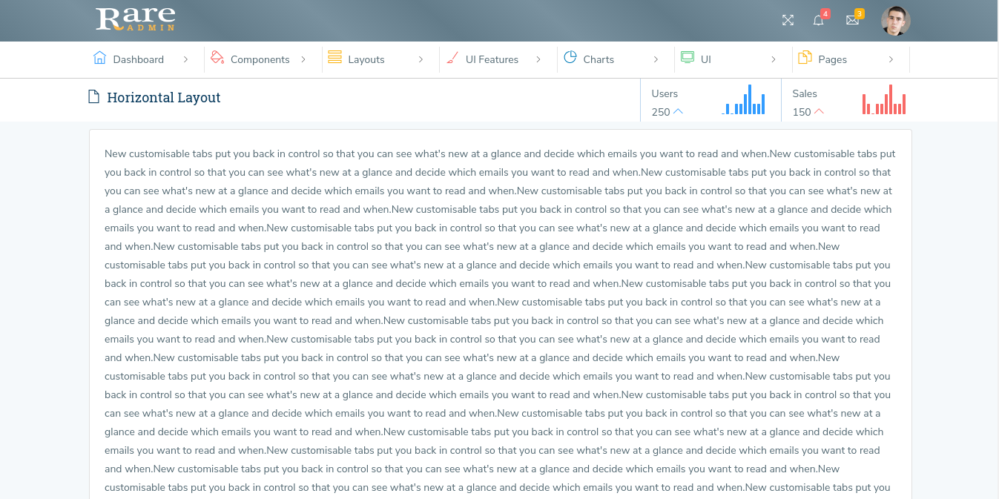

# Horizontal

The design for the Horizontal Layout is shown below:



It has the following Structure:

```text
<html>
   <head>
        <title> </title>
   </head>
<body>
     <!-- start of header -->

     <header class="header">
        <nav class="navbar navbar-static-top">
                <a href="index.html" class="logo navbar-brand float-left text-white text-center">
                        <!--It contains logo-->
                </a>
        <div class="navbar-btn float-left sidebar-toggle">
             <div>
                   <div class="bar1 first"></div>
                   <div class="bar2 second"></div>
                   <div class="bar3 third"></div>
             </div>
        </div>
        <div class="top_right_nav">
             <div class="float-left">
                  <!--It contains Header Left side sections-->
             </div>
        </div>
        </nav>
     </header>
     <!-- end of header -->

     <!-- start of horizontal menu -->

     <div class="horizontal_menu">
        <div class="container">
            <div class="row">
                <div class="col-md-12">
                    <ul id="navigation" class="slimmenu">
                        <li class="main-menu"><a href="javascript:void(0)" class="menu-list"> <span class="ti-home font_18 text-primary"> </span> Dashboard</a>
                            <ul>
                                <li>
                                    <a href="index1.html" class="sub-list">
                                        <!-- contains submenu links -->
                                    </a>
                                </li>
                                <li>
                                    <a href="index2.html" class="sub-list">
                                        <!-- contains submenu links -->
                                    </a>
                                </li>
                            </ul>
                        </li>
                        ......
                        ......
                        ......
                        ......
                        ......
                      </ul>
                   </div>   
               </div>
           </div>
      </div>       

     <!-- start of wrapper -->
     <div class="wrapper">

          <!-- Start of right Content -->

        <div class="right-aside view-port-height">

               <!--Start of Content Header (Page header) -->

               <div class="content-header container-fluid bg-white">
                     <!-- It contains page Header -->
                </div>

              <!--End of Content Header (Page header) -->


               <!--Start of Main content -->

                <div class="content">

                     <!--page content --!>

                </div>
               <!-- End of Main content --!>

         </div>

       <!-- End of right Content -->

</div>
<!--End of wrapper-->

<!--start of footer-->

<footer>
    <div class="bg-white container-fluid">
        <div class="row">
            <div class="col-lg-12 text-center">
                 <!-- It contains Footer content -->
            </div>
        </div>
    </div>

</footer>


<!--end of footer-->

</body>
</html>
```

