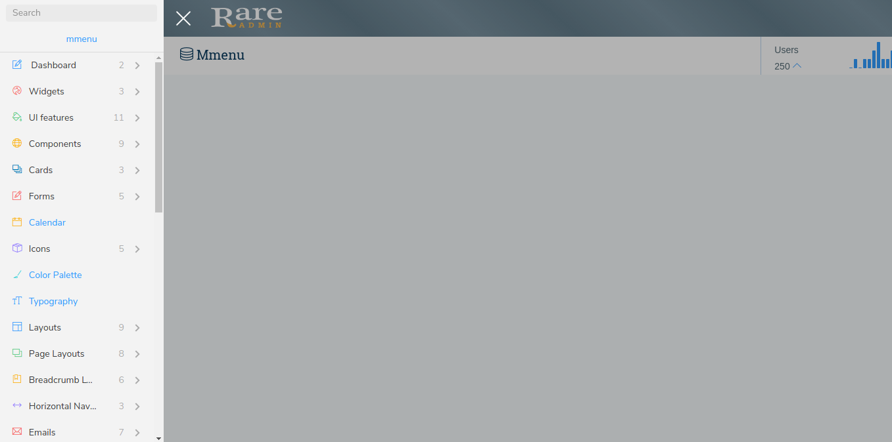

# Mmenu

The design for the Mmenu is shown below:



It has the following Structure:

```text
<html>
    <head>
        <title> </title>
    </head>
    <body>
        div id="page" class="mm-slideout">
            <a href="#" id="hamburger" class="Fixed">
         <span class="hamburger hamburger--collapse">
            <span class="hamburger-box">
                <span class="hamburger-inner"></span>
            </span>
        </span>
             </a>
        <header class="header">
             <nav class="navbar navbar-static-top">
                    <a href="index.html" class="logo navbar-brand float-left text-white text-center">
                            <!--It contains logo-->
                    </a>
              <div class="navbar-btn float-left sidebar-toggle">
                 <div>
                       <div class="bar1 first"></div>
                       <div class="bar2 second"></div>
                       <div class="bar3 third"></div>
                 </div>
              </div>
              <div class="top_right_nav">
                  <div class="float-left">
                      <!--It contains Header Left side sections-->
                  </div>
              </div>
              </nav>
        </header>
        <!-- start of wrapper -->
         <div class="wrapper">
                  <!-- End of Left side menu -->
                   <!-- Start of right Content -->

                        <div class="right-aside view-port-height">

                   <!--Start of Content Header (Page header) -->

                  <div class="content-header container-fluid bg-white">
                        <!-- It contains page Header -->
                  </div>

                  <!--End of Content Header (Page header) -->


                   <!--Start of Main content -->

                        <div class="content">

                              <!--page content --!>

                        </div>
                   <!-- End of Main content --!>

               </div>

                <!-- End of right Content -->

       </div>
       <!--End of wrapper-->
       <footer>
           <div class="bg-white container-fluid">
              <div class="row">
                 <div class="col-lg-12 text-center">
                     <!-- It contains Footer content -->
                 </div>
               </div>
           </div> 
       </footer>
    </div>
    <nav id="menu">
         <ul class="listview-icons">
             <li>
                <span><i class="menu_icon ti-pencil-alt text-primary"> </i> 
                     <!-- It contains root link --></span>
              <ul>
                  <li>
                     <a href="index1.html">
                     <!-- It contains page link -->
                         <i class="ti-angle-double-right"></i> 
                     </a>
                  </li>
                   <li>
                      <a href="index2.html">
                      <!-- It contains page link -->               
                           <i class="ti-angle-double-right"></i> Dashboard 2
                      </a>
                   </li>
               </ul>
              </li>
             .....
             .....
             .....
             .....
             .....
            </ul>
        </nav>   
    </body>
</html>
```

